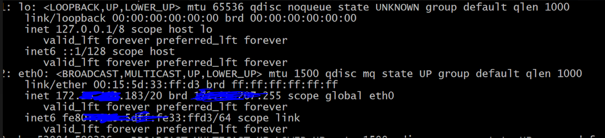
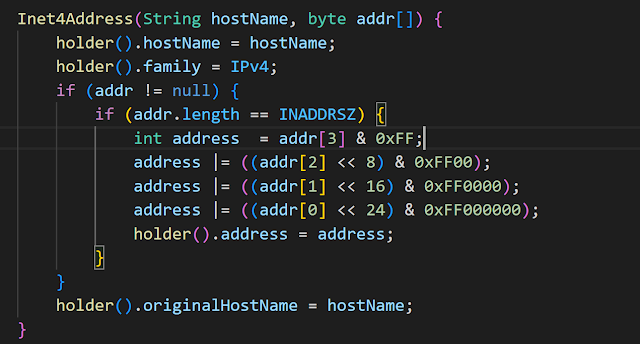

Today, I am busy helping a teammate to troubleshoot an issue in Kubernetes cluster. In the investigation, I found it is related to a question that I have been dying to figure out for a long time: what happens under the hood when you create a Java ServerSocket and bind wildcard "0.0.0.0", and this time, it is in a dual-stack host.  

For example, in my WSL, it is a dual-stack:

And then I run below Java program(just for testing):

After I run it in my WSL, I use the netstat command to check the listening socket:

Although I am binding the "0.0.0.0" which is an IPv4 wildcard,  there's a tcp6 LISTENING socket with ":::8888" which is an IPv6 wildcard!

So, why? What happens!?

Let's delve into it.

Firstly, let's check what happens when we create an InetSocketAddress with "0.0.0.0":

It will try to resolve the hostname ("0.0.0.0" in our case): InetAddress.getByName(hostname).

Let's find what does getAllByName do:

`private static InetAddress[] getAllByName(String host, InetAddress reqAddr)
        throws UnknownHostException {

        if (host == null || host.isEmpty()) {
            InetAddress[] ret = new InetAddress[1];
            ret[0] = impl.loopbackAddress();
            return ret;
        }

        validate(host);
        boolean ipv6Expected = false;
        if (host.charAt(0) == '[') {
            // This is supposed to be an IPv6 literal
            if (host.length() > 2 && host.charAt(host.length()-1) == ']') {
                host = host.substring(1, host.length() -1);
                ipv6Expected = true;
            } else {
                // This was supposed to be a IPv6 literal, but it's not
                throw invalidIPv6LiteralException(host, false);
            }
        }

        // Check and try to parse host string as an IP address literal
        if (IPAddressUtil.digit(host.charAt(0), 16) != -1
            || (host.charAt(0) == ':')) {
            byte[] addr = null;
            int numericZone = -1;
            String ifname = null;

            if (!ipv6Expected) {
                // check if it is IPv4 address only if host is not wrapped in '[]'
                try {
                    addr = IPAddressUtil.validateNumericFormatV4(host);
                } catch (IllegalArgumentException iae) {
                    var uhe = new UnknownHostException(host);
                    uhe.initCause(iae);
                    throw uhe;
                }
            }
            if (addr == null) {
                // Try to parse host string as an IPv6 literal
                // Check if a numeric or string zone id is present first
                int pos;
                if ((pos = host.indexOf('%')) != -1) {
                    numericZone = checkNumericZone(host);
                    if (numericZone == -1) { /* remainder of string must be an ifname */
                        ifname = host.substring(pos + 1);
                    }
                }
                if ((addr = IPAddressUtil.textToNumericFormatV6(host)) == null &&
                        (host.contains(":") || ipv6Expected)) {
                    throw invalidIPv6LiteralException(host, ipv6Expected);
                }
            }
            if(addr != null) {
                InetAddress[] ret = new InetAddress[1];
                if (addr.length == Inet4Address.INADDRSZ) {
                    if (numericZone != -1 || ifname != null) {
                        // IPv4-mapped address must not contain zone-id
                        throw new UnknownHostException(host + ": invalid IPv4-mapped address");
                    }
                    ret[0] = new Inet4Address(null, addr);
                } else {
                    if (ifname != null) {
                        ret[0] = new Inet6Address(null, addr, ifname);
                    } else {
                        ret[0] = new Inet6Address(null, addr, numericZone);
                    }
                }
                return ret;
            }
        } else if (ipv6Expected) {
            // We were expecting an IPv6 Literal since host string starts
            // and ends with square brackets, but we got something else.
            throw invalidIPv6LiteralException(host, true);
        }
        return getAllByName0(host, reqAddr, true, true);
    }`
    
Basically, it will resolve the hostname to an Inet4Address or Inet6Address, in our case, since the hostname we passed in is "0.0.0.0",  this method will return an Inet4Address object:

        `ret[0] = new Inet4Address(null, addr)`

`static class InetAddressHolder {
        /**
         * Reserve the original application specified hostname.
         *
         * The original hostname is useful for domain-based endpoint
         * identification (see RFC 2818 and RFC 6125).  If an address
         * was created with a raw IP address, a reverse name lookup
         * may introduce endpoint identification security issue via
         * DNS forging.
         *
         * Oracle JSSE provider is using this original hostname, via
         * jdk.internal.misc.JavaNetAccess, for SSL/TLS endpoint identification.
         *
         * Note: May define a new public method in the future if necessary.
         */
        String originalHostName;

        InetAddressHolder() {}

        InetAddressHolder(String hostName, int address, int family) {
            this.originalHostName = hostName;
            this.hostName = hostName;
            this.address = address;
            this.family = family;
        }

        void init(String hostName, int family) {
            this.originalHostName = hostName;
            this.hostName = hostName;
            if (family != -1) {
                this.family = family;
            }
        }

        String hostName;

        String getHostName() {
            return hostName;
        }

        String getOriginalHostName() {
            return originalHostName;
        }

        /**
         * Holds a 32-bit IPv4 address.
         */
        int address;

        int getAddress() {
            return address;
        }

        /**
         * Specifies the address family type, for instance, '1' for IPv4
         * addresses, and '2' for IPv6 addresses.
         */
        int family;

        int getFamily() {
            return family;
        }
    }`

We can see that the InetAddressHolder's family is set to "IPv4," and the Inet4Address is returned.

Go back to:

`public InetSocketAddress(String hostname, int port) {
        checkHost(hostname);
        InetAddress addr = null;
        String host = null;
        try {
            addr = InetAddress.getByName(hostname);
        } catch(UnknownHostException e) {
            host = hostname;
        }
        holder = new InetSocketAddressHolder(host, addr, checkPort(port));
    }`
    
Until now, we got an InetSocketAddress object, whose "addr" field is an Inet4Address.

Let's continue getting into the bind method of ServerSocket:

`/**
     *
     * Binds the {@code ServerSocket} to a specific address
     * (IP address and port number).
     * 

     * If the address is {@code null}, then the system will pick up
     * an ephemeral port and a valid local address to bind the socket.
     *
     * @param   endpoint        The IP address and port number to bind to.
     * @throws  IOException if the bind operation fails, or if the socket
     *                     is already bound.
     * @throws  SecurityException       if a {@code SecurityManager} is present and
     * its {@code checkListen} method doesn't allow the operation.
     * @throws  IllegalArgumentException if endpoint is a
     *          SocketAddress subclass not supported by this socket
     * @since 1.4
     */
    public void bind(SocketAddress endpoint) throws IOException {
        bind(endpoint, 50);
    }`

`public void bind(SocketAddress endpoint, int backlog) throws IOException {
        if (isClosed())
            throw new SocketException("Socket is closed");
        if (isBound())
            throw new SocketException("Already bound");
        if (endpoint == null)
            endpoint = new InetSocketAddress(0);
        if (!(endpoint instanceof InetSocketAddress epoint))
            throw new IllegalArgumentException("Unsupported address type");
        if (epoint.isUnresolved())
            throw new SocketException("Unresolved address");
        if (backlog < 1)
          backlog = 50;
        try {
            @SuppressWarnings("removal")
            SecurityManager security = System.getSecurityManager();
            if (security != null)
                security.checkListen(epoint.getPort());
            getImpl().bind(epoint.getAddress(), epoint.getPort());
            getImpl().listen(backlog);
            bound = true;
        } catch(SecurityException e) {
            bound = false;
            throw e;
        } catch(IOException e) {
            bound = false;
            throw e;
        }
    }`

`SocketImpl getImpl() throws SocketException {
        if (!created)
            createImpl();
        return impl;
    }
 void createImpl() throws SocketException {
        if (impl == null)
            setImpl();
        try {
            impl.create(true);
            created = true;
        } catch (IOException e) {
            throw new SocketException(e.getMessage());
        }
    }`
`private void setImpl() {
        SocketImplFactory factory = ServerSocket.factory;
        if (factory != null) {
            impl = factory.createSocketImpl();
        } else {
            impl = SocketImpl.createPlatformSocketImpl(true);
        }
    }`

Since we haven't set the SocketImplFactory, we will go into SocketImpl.createPlatformSocketImpl(true):

`public abstract class SocketImpl implements SocketOptions {
    private static final boolean USE_PLAINSOCKETIMPL = usePlainSocketImpl();

    private static boolean usePlainSocketImpl() {
        PrivilegedAction<String> pa = () -> NetProperties.get("jdk.net.usePlainSocketImpl");
        @SuppressWarnings("removal")
        String s = AccessController.doPrivileged(pa);
        return (s != null) && !s.equalsIgnoreCase("false");
    }

    /**
     * Creates an instance of platform's SocketImpl
     */
    @SuppressWarnings("unchecked")
    static <S extends SocketImpl & PlatformSocketImpl> S createPlatformSocketImpl(boolean server) {
        if (USE_PLAINSOCKETIMPL) {
            return (S) new PlainSocketImpl(server);
        } else {
            return (S) new NioSocketImpl(server);
        }
    }`

The comment in SocketImpl class is very important:

`/**
 * The abstract class {@code SocketImpl} is a common superclass
 * of all classes that actually implement sockets. It is used to
 * create both client and server sockets.
 *
 * @implNote Client and server sockets created with the {@code Socket} and
 * {@code SocketServer} public constructors create a system-default
 * {@code SocketImpl}. The JDK historically used a {@code SocketImpl}
 * implementation type named "PlainSocketImpl" that has since been replaced by a
 * newer implementation. The JDK continues to ship with the older implementation
 * to allow code to run that depends on unspecified behavior that differs between
 * the old and new implementations. The old implementation will be used if the
 * Java virtual machine is started with the system property {@systemProperty
 * jdk.net.usePlainSocketImpl} set to use the old implementation. It may also be
 * set in the JDK's network configuration file, located in {@code
 * ${java.home}/conf/net.properties}. The value of the property is the string
 * representation of a boolean. If set without a value then it defaults to {@code
 * true}, hence running with {@code -Djdk.net.usePlainSocketImpl} or {@code
 * -Djdk.net.usePlainSocketImpl=true} will configure the Java virtual machine
 * to use the old implementation. The property and old implementation will be
 * removed in a future version.
 *
 * @since   1.0
 */`

Since we haven't set the property of "jdk.net.usePlainSocketImpl", the NioSocketImpl will be returned. That means Java will use NioSocketImpl by default! (The JDK version in my host is: JDK 17).

And then let's check the bind method of NioSocketImpl:
    `@Override
    protected void bind(InetAddress host, int port) throws IOException {
        synchronized (stateLock) {
            ensureOpen();
            if (localport != 0)
                throw new SocketException("Already bound");
            NetHooks.beforeTcpBind(fd, host, port);
            Net.bind(fd, host, port);
            // set the address field to the given host address to keep
            // compatibility with PlainSocketImpl. When binding to 0.0.0.0
            // then the actual local address will be ::0 when IPv6 is enabled.
            address = host;
            localport = Net.localAddress(fd).getPort();
        }
    }`

We can see that it will call Net.bind() method. Let's go into it:
`public static void bind(FileDescriptor fd, InetAddress addr, int port)
        throws IOException
    {
        bind(UNSPEC, fd, addr, port);
    }`

`// unspecified protocol family
    static final ProtocolFamily UNSPEC = new ProtocolFamily() {
        public String name() {
            return "UNSPEC";
        }
    };`

UNSPEC means there's no specified  IP Family.

`static void bind(ProtocolFamily family, FileDescriptor fd,
                     InetAddress addr, int port) throws IOException
    {
        boolean preferIPv6 = isIPv6Available() &&
            (family != StandardProtocolFamily.INET);
        if (addr.isLinkLocalAddress()) {
            addr = IPAddressUtil.toScopedAddress(addr);
        }
        bind0(fd, preferIPv6, exclusiveBind, addr, port);
    }`

In the above bind method, firstly,  we will check whether preferIPv6 by checking isIPv6Available method and whether the family is unequal to INET(INET stands for IPv4), in our case, the family is "UNSPEC". and the isIPv6Available method is actually will turn to a native method:
`**
     * Tells whether dual-IPv4/IPv6 sockets should be used.
     */
    static boolean isIPv6Available() {
        if (!checkedIPv6) {
            isIPv6Available = isIPv6Available0();
            checkedIPv6 = true;
        }
        return isIPv6Available;
    }`

 `private static native boolean isIPv6Available0();`

We will go into this native method later. For this moment, let's continue.

In our case, since we are in a dual-stack host, the IPv6 is available, and the IP family here is not INET, so, preferIPv6 will be true! (this is very important, keep in mind)

And finally, it will go to the native bind0 method:
`private static native void bind0(FileDescriptor fd, boolean preferIPv6,
                                     boolean useExclBind, InetAddress addr,
                                     int port)`
Then we need to find the source code of this native method. It is located in the JDK source code's [Net.c]([url](https://github.com/openjdk/jdk/blob/master/src/java.base/unix/native/libnio/ch/Net.c
)) file, 

`Java_sun_nio_ch_Net_bind0(JNIEnv *env, jclass clazz, jobject fdo, jboolean preferIPv6,
                          jboolean useExclBind, jobject iao, int port)
{
    SOCKETADDRESS sa;
    int sa_len = 0;
    int rv = 0;

    if (NET_InetAddressToSockaddr(env, iao, port, &sa, &sa_len,
                                  preferIPv6) != 0) {
        return;
    }

    rv = NET_Bind(fdval(env, fdo), &sa, sa_len);
    if (rv != 0) {
        handleSocketError(env, errno);
    }
}`

There's a very important method: NET_InetAddressToSockaddr.
It is located at: [net_util_md.c]([url](https://github.com/openjdk/jdk/blob/master/src/java.base/unix/native/libnet/net_util_md.c))

Let's get into it:
`/**
 * See net_util.h for documentation
 */
JNIEXPORT int JNICALL
NET_InetAddressToSockaddr(JNIEnv *env, jobject iaObj, int port,
                          SOCKETADDRESS *sa, int *len,
                          jboolean v4MappedAddress)
{
    jint family = getInetAddress_family(env, iaObj);
    JNU_CHECK_EXCEPTION_RETURN(env, -1);
    memset((char *)sa, 0, sizeof(SOCKETADDRESS));

    if (ipv6_available() &&
        !(family == java_net_InetAddress_IPv4 &&
          v4MappedAddress == JNI_FALSE))
    {
        jbyte caddr[16];
        jint address;

        if (family == java_net_InetAddress_IPv4) {
            // convert to IPv4-mapped address
            memset((char *)caddr, 0, 16);
            address = getInetAddress_addr(env, iaObj);
            JNU_CHECK_EXCEPTION_RETURN(env, -1);
            if (address == INADDR_ANY) {
                /* we would always prefer IPv6 wildcard address
                 * caddr[10] = 0xff;
                 * caddr[11] = 0xff; */
            } else {
                caddr[10] = 0xff;
                caddr[11] = 0xff;
                caddr[12] = ((address >> 24) & 0xff);
                caddr[13] = ((address >> 16) & 0xff);
                caddr[14] = ((address >> 8) & 0xff);
                caddr[15] = (address & 0xff);
            }
        } else {
            getInet6Address_ipaddress(env, iaObj, (char *)caddr);
        }
        sa->sa6.sin6_port = htons(port);
        memcpy((void *)&sa->sa6.sin6_addr, caddr, sizeof(struct in6_addr));
        sa->sa6.sin6_family = AF_INET6;
        if (len != NULL) {
            *len = sizeof(struct sockaddr_in6);
        }

        /* handle scope_id */
        if (family != java_net_InetAddress_IPv4) {
            if (ia6_scopeidID) {
                sa->sa6.sin6_scope_id = getInet6Address_scopeid(env, iaObj);
            }
        }
    } else {
        jint address;
        if (family != java_net_InetAddress_IPv4) {
            JNU_ThrowByName(env, JNU_JAVANETPKG "SocketException", "Protocol family unavailable");
            return -1;
        }
        address = getInetAddress_addr(env, iaObj);
        JNU_CHECK_EXCEPTION_RETURN(env, -1);
        sa->sa4.sin_port = htons(port);
        sa->sa4.sin_addr.s_addr = htonl(address);
        sa->sa4.sin_family = AF_INET;
        if (len != NULL) {
            *len = sizeof(struct sockaddr_in);
        }
    }
    return 0;
}` 

Firstly, it will get the Family field from the Java InetAddress object!
`int getInetAddress_family(JNIEnv *env, jobject iaObj) {
    int family;
    jobject holder = (*env)->GetObjectField(env, iaObj, ia_holderID);
    CHECK_NULL_THROW_NPE_RETURN(env, holder, "InetAddress holder is null", -1);
    family = (*env)->GetIntField(env, holder, iac_familyID);
    (*env)->DeleteLocalRef(env, holder);
    return family;
}`

The Java InetAddress object we got in the previous step,  its family field is "IPv4"!

Then it will check whether IPv6 address is available by calling method ipv6_available():

`JNIEXPORT jint JNICALL ipv6_available()
{
    return IPv6_available;
}`

`/*
     * Since we have initialized and loaded the socket library we will
     * check now whether we have IPv6 on this platform and if the
     * supporting socket APIs are available
     */
    IPv4_available = IPv4_supported();
    IPv6_available = IPv6_supported() & (!preferIPv4Stack);`

It will check the IPv6_Supported method and preferIPv4Stack environment property:

`DEF_JNI_OnLoad(JavaVM *vm, void *reserved)
{
    JNIEnv *env;
    jclass iCls;
    jmethodID mid;
    jstring s;
    jint preferIPv4Stack;
    if ((*vm)->GetEnv(vm, (void**) &env, JNI_VERSION_1_2) != JNI_OK) {
        return JNI_EVERSION; /* JNI version not supported */
    }

    iCls = (*env)->FindClass(env, "java/lang/Boolean");
    CHECK_NULL_RETURN(iCls, JNI_VERSION_1_2);
    mid = (*env)->GetStaticMethodID(env, iCls, "getBoolean", "(Ljava/lang/String;)Z");
    CHECK_NULL_RETURN(mid, JNI_VERSION_1_2);
    s = (*env)->NewStringUTF(env, "java.net.preferIPv4Stack");
    CHECK_NULL_RETURN(s, JNI_VERSION_1_2);
    preferIPv4Stack = (*env)->CallStaticBooleanMethod(env, iCls, mid, s);`

The IPv6_Supported method is very straightforward! It will try to create an IPv6 socket, if it fails, it means IPv6 is unsupported,  if it success, it means IPv6 is supported!!

`jint  IPv6_supported()
{
    int fd;
    void *ipv6_fn;
    SOCKETADDRESS sa;
    socklen_t sa_len = sizeof(SOCKETADDRESS);

    fd = socket(AF_INET6, SOCK_STREAM, 0) ;
    if (fd < 0) {
        /*
         *  TODO: We really can't tell since it may be an unrelated error
         *  for now we will assume that AF_INET6 is not available
         */
        return JNI_FALSE;
    }
    close(fd);

    /**
     * Linux - check if any interface has an IPv6 address.
     * Don't need to parse the line - we just need an indication.
     */
#ifdef __linux__
    {
        FILE *fP = fopen("/proc/net/if_inet6", "r");
        char buf[255];
        char *bufP;

        if (fP == NULL) {
            return JNI_FALSE;
        }
        bufP = fgets(buf, sizeof(buf), fP);
        fclose(fP);
        if (bufP == NULL) {
            return JNI_FALSE;
        }
    }
#endif

    /*
     *  OK we may have the stack available in the kernel,
     *  we should also check if the APIs are available.
     */
    ipv6_fn = JVM_FindLibraryEntry(RTLD_DEFAULT, "inet_pton");
    if (ipv6_fn == NULL ) {
        return JNI_FALSE;
    } else {
        return JNI_TRUE;
    }
}
#endif /* DONT_ENABLE_IPV6 */`

Let's go back to NET_InetAddressToSockaddr method.

This method is very important, actually, the answer to our question is in this method, I will add some comments to it:

`NET_InetAddressToSockaddr(JNIEnv *env, jobject iaObj, int port,
                          SOCKETADDRESS *sa, int *len,
                          jboolean v4MappedAddress)
{
    jint family = getInetAddress_family(env, iaObj); -- Eric: Get family from java 
                                                        InetAddress Object, IPv4
    JNU_CHECK_EXCEPTION_RETURN(env, -1);
    memset((char *)sa, 0, sizeof(SOCKETADDRESS));

    if (ipv6_available() &&                         --Eric- yes, IPv6 is available.
        !(family == java_net_InetAddress_IPv4 &&      --Eric- yes, IP family is IPv4
          v4MappedAddress == JNI_FALSE))   --Eric- Yes, v4MappedAddress is true, 
                                               because preferIPv6 is true
    {
        jbyte caddr[16];
        jint address;

        if (family == java_net_InetAddress_IPv4) {
            // convert to IPv4-mapped address   ---Eric: most important!!----
            memset((char *)caddr, 0, 16);     -Eric-: create memory for IPv6 address
            address = getInetAddress_addr(env, iaObj); -Eric-: get IP address from Java
                                                        Inet4Address object
            JNU_CHECK_EXCEPTION_RETURN(env, -1);
            if (address == INADDR_ANY) {  -Eric-: Yes, because we pass the "0.0.0.0"        
                /* we would always prefer IPv6 wildcard address
                 * caddr[10] = 0xff;
                 * caddr[11] = 0xff; */
               //Eric: Do nothing here,  so the caddr is all zero!!, which means caddr
               //equals to :: !
            } else {
                caddr[10] = 0xff;
                caddr[11] = 0xff;
                caddr[12] = ((address >> 24) & 0xff);
                caddr[13] = ((address >> 16) & 0xff);
                caddr[14] = ((address >> 8) & 0xff);
                caddr[15] = (address & 0xff);
            }
        } else {
            getInet6Address_ipaddress(env, iaObj, (char *)caddr);
        }
        sa->sa6.sin6_port = htons(port);
        //
        memcpy((void *)&sa->sa6.sin6_addr, caddr, sizeof(struct in6_addr));
        sa->sa6.sin6_family = AF_INET6;
        if (len != NULL) {
            *len = sizeof(struct sockaddr_in6);
        }

        /* handle scope_id */
        if (family != java_net_InetAddress_IPv4) {
            if (ia6_scopeidID) {
                sa->sa6.sin6_scope_id = getInet6Address_scopeid(env, iaObj);
            }
        }
    } else {
        jint address;
        if (family != java_net_InetAddress_IPv4) {
            JNU_ThrowByName(env, JNU_JAVANETPKG "SocketException", "Protocol family unavailable");
            return -1;
        }
        address = getInetAddress_addr(env, iaObj);
        JNU_CHECK_EXCEPTION_RETURN(env, -1);
        sa->sa4.sin_port = htons(port);
        sa->sa4.sin_addr.s_addr = htonl(address);
        sa->sa4.sin_family = AF_INET;
        if (len != NULL) {
            *len = sizeof(struct sockaddr_in);
        }
    }
    return 0;
}`

In this method, if it is in a dual-stack environment where IPv6 is supported,  then IPv4 address will be mapped to IPv6, including the wildcard!  That's why we only bind "0.0.0.0", but IPv6's wildcard "::" also bonded! !!

Finally, we get to the really bind method:

`/*
 * Wrapper for bind system call - performs any necessary pre/post
 * processing to deal with OS specific issues :-
 *
 * Linux allows a socket to bind to 127.0.0.255 which must be
 * caught.
 */
int
NET_Bind(int fd, SOCKETADDRESS *sa, int len)
{
    int rv;

#ifdef __linux__
    /*
     * ## get bugId for this issue - goes back to 1.2.2 port ##
     * ## When IPv6 is enabled this will be an IPv4-mapped
     * ## with family set to AF_INET6
     */
    if (sa->sa.sa_family == AF_INET) {
        if ((ntohl(sa->sa4.sin_addr.s_addr) & 0x7f0000ff) == 0x7f0000ff) {
            errno = EADDRNOTAVAIL;
            return -1;
        }
    }
#endif

    rv = bind(fd, &sa->sa, len);

    return rv;
}`

It invokes the system call "bind" to complete the binding operation! 

This is the most complicated code reading for me. However, it deserves it! 

Hope you enjoy this journey!
